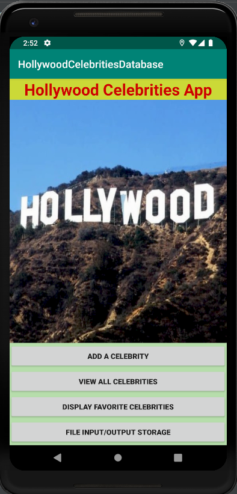
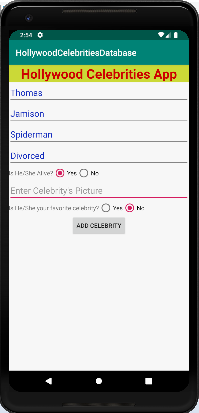
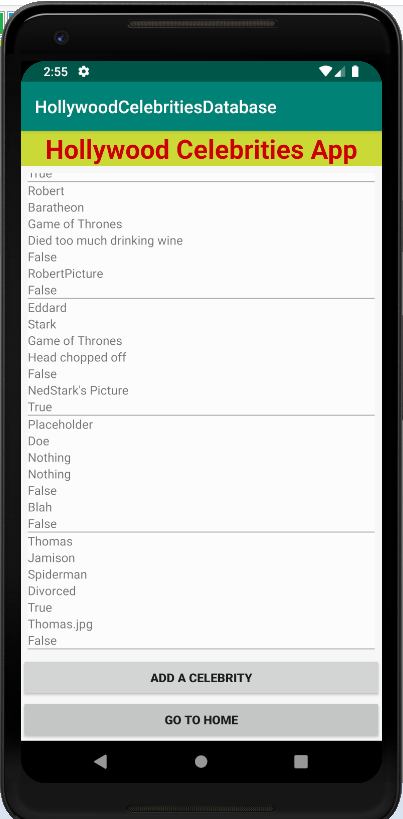
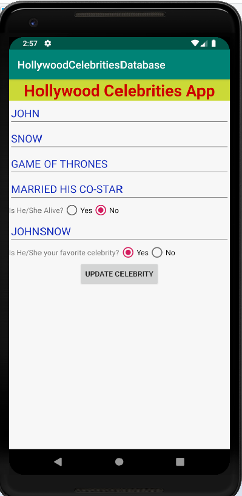
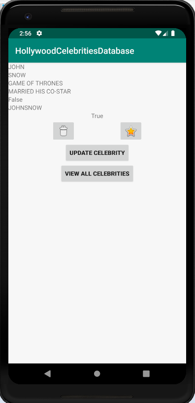
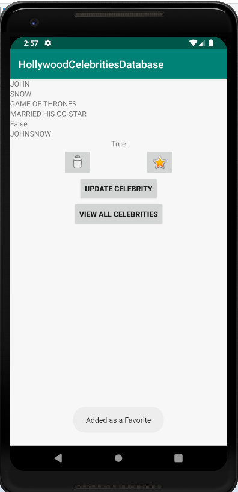
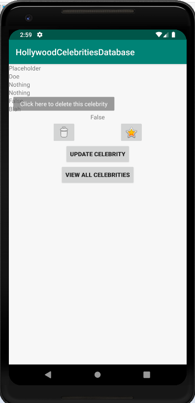
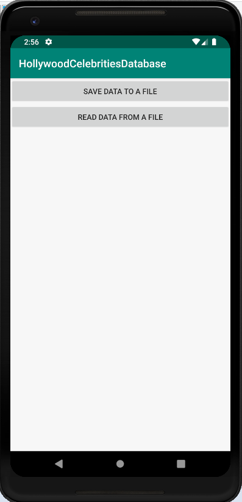
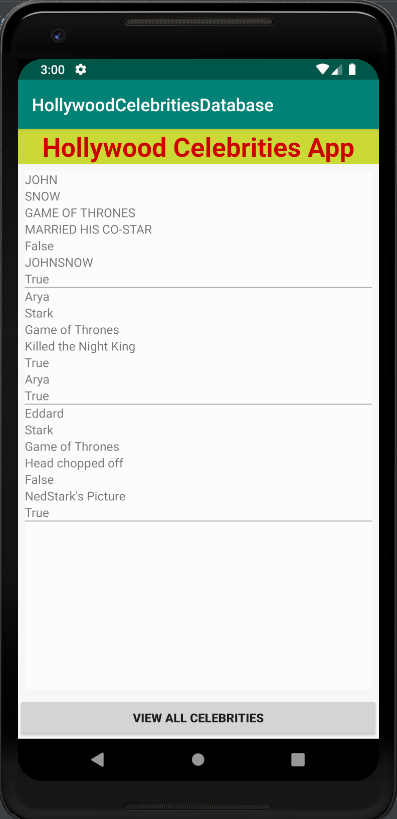

# Week3Daily2CelebritiesApp
Hollywood Celebrities App

Coding

Create an application that has a celebrity database
1. User can add a new celebrity by “AddNewCelebrity” 
a. Can view all the celebrities (ViewCelebrities)
b. Can update a celebrity from the list (ViewCelebrity)
c. Can remove a celebrity from the list (ImageButton)
d. Can make a celebrity as favorite (ImageButton)
e. Can view all the favorite celebrity (MyFavorites) activity
f. Has a feature to write content to a file 
g. Has a feature to read contents from that file.
2. Create a custom content provider with the celebrity SQL database.  Then retrieve data from that content provider and populate the recyclerView
5. The UI needs to be presentable.  Please spend time making the UI your own.  Experiment.

Instructions:

- Run the Android project
- Create a new Virtual Device if not already. Then, choose Pixel 2 XL, then click OK.
- User can add a celebrity, view all celebrities, display favorite celebrities, or file inout/output storage.
- User can also delete, update or add as a favorite on each individual celebrity details page.

